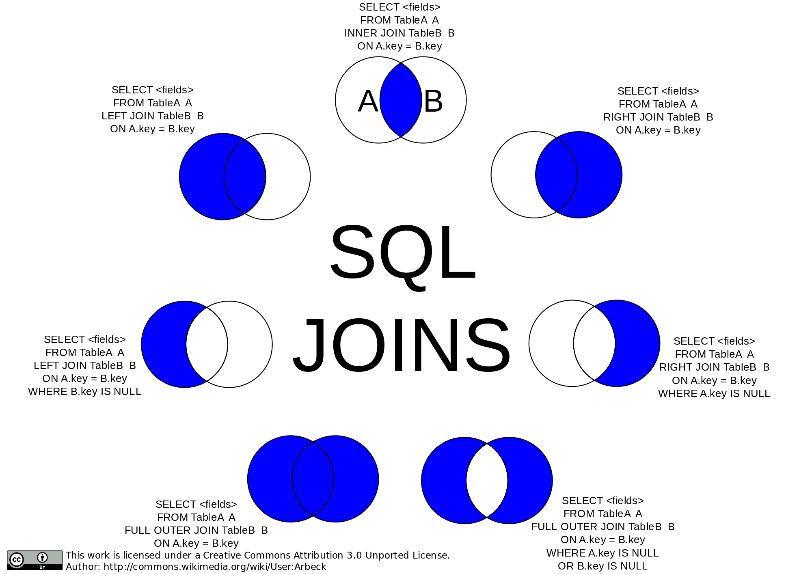

#Fazendo consultas no SQL

A consulta de informações representa uma das principais funcionalidades em um banco de dados. Uma consulta é capaz de fornecer informações para os mais diversos propósitos, desde os dados de um cliente específico, até o lucro mensal da empresa. Portanto, é fundamental que o usuário do banco de dados entenda corretamente como funciona as funcionalidades de consultas disponíveis na linguagem SQL.

Este documento tem como objetivo demonstrar os principais recursos disponíveis para consulta de dados na linguagem SQL.


##O Comando SELECT

Para realizar consultas ao banco de dados na liguagem SQL, utiliza-se o comando `SELECT`. A sintaxe simplificada do comando `SELECT` pode ser vista no trecho de código abaixo:

```
SELECT campos FROM tabela
WHERE restricoes;
```

Basicamente, o comando `SELECT` admite dois parâmetros: `campos` e `tabela`. O parâmetro `campos` informa a lista de campos que serão recuperados para cada registro encontrado na execução do comando `SELECT`. Já o parâmetro `tabela` informa a tabela na qual os registros serão buscados.

A cláusula `WHERE` restringe os registros que serão selecionados, de forma que os registros serão selecionados somente se seus dados estiverem de acordo com as restrições declaradas na cláusula `WHERE`. Para selecionar todos os registros basta **não** declarar as restrições.

O trecho de código abaixo mostra um exemplo de utilização do comando `SELECT`:

```
/* seleciona todas as categorias */
SELECT * FROM categorias;

/*
	seleciona a descrição e a data limite das
	tarefas que ainda não foram concluídas
*/
SELECT descricao, data_limite FROM tarefas
WHERE data_limite > NOW();
```

###A Cláusula WHERE

Quando o comando `SELECT` é utilizado, ele recupera todos os dados da tabela. No entanto, é comum o usuário do banco de dados desejar filtrar os dados provenientes da consulta. Dessa forma ele pode analisar somente os registros que lhe interessa. A linguagem SQL disponibiliza uma cláusula específica para fazer esse tipo de filtragem: `WHERE`. A sintaxe da cláusula `WHERE` pode ser vista abaixo:

```
SELECT ...
WHERE restricoes
```

O funcionamento da cláusula `WHERE` é extremamente simples. Para cada registro, ela verifica se esse registro obedece as restrições declaradas e, caso afirmativo, esse registro é filtrado e selecionado para exibição.

A cláusula é composta por uma série de **restrições**. Tais restrições são utilizadas justamente para a filtragem dos registros. Essas restrições devem ser declaradas na forma comparativa, similar as expressões condicionais de uma linguagem de programação. O trecho de código abaixo mostra o exemplo de um `SELECT` restringido por meio de uma restrição declarada no `WHERE`:

```
/* Seleciona usuários que possuem João em seu nome */
SELECT * FROM usuarios
WHERE nome LIKE '%João%';
```

A linguagem SQL traz consigo uma série de operadores que podem ser utilizados para estabelecer restrições na cláusua `WHERE`:

| Operador     | Descrição                           | Exemplo                          |
|--------------|-------------------------------------|----------------------------------|
| `=`            | Igual                               | `WHERE id = 2`                     |
| `<>` ou `!=`     | Diferente                           | `WHERE data <> CURDATE()`          |
| `>`            | Maior que                           | `WHERE idade > 18`                 |
| `<`            | Menor que                           | `WHERE renda < 1800.00`            |
| `>=`           | Maior ou igual a                    | `WHERE peso >= 70`                 |
| `<=`           | Menor ou igual a                    | `WHERE altura <= 170`              |
| `BETWEEN`      | Em um intervalo incluso             | `WHERE idade BETWEEN 20 AND 30`    |
| `LIKE`         | Padrão textual                      | `WHERE nome LIKE '%Alfredo%'`      |
| `IN` ou `EXISTS` | Faz parte de um conjunto de valores | `WHERE id IN (20, 21, 25, 37, 40)` |


Ainda, é possível combinar restrições por meio de operadores lógicos. A linguagem SQL possui dois operadores lógicos para isso: `AND`e `OR`. O operador `AND` filtra o registro caso atenda a todas as restrições. Já o operador `OR` filtra o registro caso atenda a pelo menos uma restrição. O trecho de código abaixo mostra dois exemplos de consulta, uma utilizando cada tipo de operador:

```
SELECT * FROM usuarios
WHERE idade >= 18 AND sexo = 'M';

SELECT * FROM usuarios
WHERE nome LIKE '%José%' OR email LIKE '%José%';
```


<!--Como podemos observar, o comando `SELECT` permite que se selecione dados de uma tabela de forma simples e direta. No entanto, a maioria dos sistemas possui uma base de dados composta por várias tabelas, e muitas vezes a informação que o usuário deseja buscar é obtida apenas a partir da combinação dos dados de várias tabelas. Neste caso, é necessário fazer um cruzamento dos dados dessas tabelas para obter a informação desejada.-->


##Cruzando dados em uma consulta SQL

Grande parte das consultas realizadas em um banco de dados dependem de informações presentes em mais de uma tabela. Por exemplo: *"Desejo recuperar todas as tarefas e o nome de seus respectivos usuários"*. Para conseguir recuperar tal informação, é necessário acessar a tabela **usuarios** para recuperar o nome do usuário, e a tabela **tarefas**, para recuperar as tarefas existentes.

Para conseguir recuperar essas informações, é necessário fazer uma consulta que combine os dados de várias tabelas, de forma a obter a informação desejada. O comando `SELECT` permite fazer esse cruzamento de dados por meio da junção de tabelas. Mais especificamente, esta junção pode ser feita de duas formas:

1. Utilizando a cláusula `FROM`
2. Utilizando a cláusula `JOIN`

###Utilizando FROM para junção de tabelas

A utilização da cláusula `FROM` era a forma padrão para junção de tabelas em antigas versões da linguagem SQL. Basicamente, a junção é feita através da declaração de mais de uma tabela na cláusula `FROM` de um comando `SELECT`. Ao se utilizar a cláusula `FROM` para fazer junção de tabelas, o SGBD faz um produto cartesiano entre as tabelas selecionadas<!--, gerando todas as combinações possíveis entre os registros das tabelas declaradas no `FROM`-->. Posteriormente, a filtragem desses registros é feito por meio das restrições declaradas na cláusula `WHERE`.

O trecho de código abaixo mostra a sintaxe básica de junção por meio do `FROM`:

```
SELECT campos FROM tabela1, tabela2, tabelaN
WHERE tabela1.pkey = tabela2.fkey AND tabela2.pkey = tabelaN.fkey
```

Como se pode observar, a relação entre as tabelas é feita por meio da comparação entre as chaves primárias e estrangeiras que cada uma possui. Nota-se também que a referência dos campos deve estar sempre atrelado a tabela na qual aquele campo pertence. Sem essa relação, o SGBD não saberia distinguir qual campo pertence a qual tabela, inviabilizando assim as comparações de suas chaves. O trecho de código abaixo representa a consulta descrita no início dessa seção:

```
SELECT tarefas.*, usuarios.nome FROM tarefas, usuarios
WHERE tarefas.user_id = usuarios.id
```

É possível atribuir nome as tabelas, de forma a facilitar a escrita de consultas mais elaboradas. O exemplo abaixo mostra como ficaria a consulta anterior com as tabelas devidamente nomeadas:

```
SELECT t.*, u.nome FROM tarefas t, usuarios u
WHERE t.user_id = u.id
```

#### O problema do Produto Cartesiano

Como já dito anteriormente, a junção por meio do `FROM` gera um produto cartesiano de todas os registros das tabelas envolvidas na consulta. O produto cartesiano nada mais é do que a combinação de um registro de uma tabela com todas as demais. Como se pode imaginar, tal ação implica um overhead de processamento, uma vez que o SGBD seleciona todas as combinações possíveis, e somente então descarta as que não se encaixam nas restrições impostas pela cláusula `WHERE`.

Para exemplificar o funcionamento do produto cartesiano, vamos analisar o exemplo a seguir:

<table>
  <tr>
    <th colspan="4">usuarios</th>
  </tr>
  <tr>
    <td>id</td>
    <td>nome</td>
    <td>email</td>
    <td>senha</td>
  </tr>
  <tr>
    <td>01</td>
    <td>Joao</td>
    <td>joao@email.com</td>
    <td>123</td>
  </tr>
  <tr>
    <td>02</td>
    <td>Pedro</td>
    <td>pedro@email.com</td>
    <td>123</td>
  </tr>
</table>

<table>
  <tr>
    <th colspan="4">tarefas</th>
  </tr>
  <tr>
    <td>id</td>
    <td>descricao</td>
    <td>usuarios_id</td>
    <td>categorias_id</td>
  </tr>
  <tr>
    <td>01</td>
    <td>Fazer dever</td>
    <td>01</td>
    <td>01</td>
  </tr>
  <tr>
    <td>02</td>
    <td>Lavar carro</td>
    <td>01</td>
    <td>02</td>
  </tr>
  <tr>
    <td>03</td>
    <td>Comprar presente</td>
    <td>02</td>
    <td>02</td>
  </tr>
  <tr>
    <td>04</td>
    <td>Fazer jantar</td>
    <td>01</td>
    <td>02</td>
  </tr>
</table>

A Tabela **usuarios** contém os dados dos usuários cadastrados no sistema. Já a tabela **tarefas** contém as tarefas de todos os usuários cadastrados. Em um determinado momento, o usuário do banco de dados deseja recuperar todas as tarefas do João. Para isso, o usuário escreve a seguinte consulta:

```
SELECT tarefas.*, usuarios.* FROM tarefas, usuarios
WHERE tarefas.usuarios_id = usuarios.id AND usuarios.nome LIKE '%João%'
```

Ao executar essa consulta, o SGBD primeiro faz o produto cartesiano, e somente então filtras as tarefas. Neste exemplo, a consulta geraria a seguinte tabela:

<table>
  <tr>
    <th colspan="8">tarefas_usuarios</th>
  </tr>
  <tr>
    <td>id</td>
    <td>descricao</td>
    <td>usuarios_id</td>
    <td>categorias_id</td>
    <td>id</td>
    <td>nome</td>
    <td>email</td>
    <td>senha</td>
  </tr>
  <tr>
    <td>01</td>
    <td>Fazer dever</td>
    <td>01</td>
    <td>01</td>
    <td>01</td>
    <td>João</td>
    <td>joao@email.com</td>
    <td>123</td>
  </tr>
  <tr>
    <td>02</td>
    <td>Lavar carro</td>
    <td>01</td>
    <td>02</td>
    <td>01</td>
    <td>João</td>
    <td>joao@email.com</td>
    <td>123</td>
  </tr>
  <tr>
    <td>03</td>
    <td>Comprar presente</td>
    <td>02</td>
    <td>02</td>
    <td>01</td>
    <td>João</td>
    <td>joao@email.com</td>
    <td>123</td>
  </tr>
  <tr>
    <td>04</td>
    <td>Fazer jantar</td>
    <td>01</td>
    <td>02</td>
    <td>01</td>
    <td>João</td>
    <td>joao@email.com</td>
    <td>123</td>
  </tr>
  <tr>
    <td>01</td>
    <td>Fazer dever</td>
    <td>01</td>
    <td>01</td>
    <td>02</td>
    <td>Pedro</td>
    <td>pedro@email.com</td>
    <td>123</td>
  </tr>
  <tr>
    <td>02</td>
    <td>Lavar carro</td>
    <td>01</td>
    <td>02</td>
    <td>02</td>
    <td>Pedro</td>
    <td>pedro@email.com</td>
    <td>123</td>
  </tr>
  <tr>
    <td>03</td>
    <td>Comprar presente</td>
    <td>02</td>
    <td>02</td>
    <td>02</td>
    <td>Pedro</td>
    <td>pedro@email.com</td>
    <td>123</td>
  </tr>
  <tr>
    <td>04</td>
    <td>Fazer jantar</td>
    <td>01</td>
    <td>02</td>
    <td>02</td>
    <td>Pedro</td>
    <td>pedro@email.com</td>
    <td>123</td>
  </tr>
</table>

Esta tabela então sofreria a filtragem dos dados por meio da cláusula `WHERE`, gerando o seguinte resultado:

<table>
  <tr>
    <th colspan="8">tarefas_usuarios</th>
  </tr>
  <tr>
    <td>id</td>
    <td>descricao</td>
    <td>usuarios_id</td>
    <td>categorias_id</td>
    <td>id</td>
    <td>nome</td>
    <td>email</td>
    <td>senha</td>
  </tr>
  <tr>
    <td>01</td>
    <td>Fazer dever</td>
    <td>01</td>
    <td>01</td>
    <td>01</td>
    <td>João</td>
    <td>joao@email.com</td>
    <td>123</td>
  </tr>
  <tr>
    <td>02</td>
    <td>Lavar carro</td>
    <td>01</td>
    <td>02</td>
    <td>01</td>
    <td>João</td>
    <td>joao@email.com</td>
    <td>123</td>
  </tr>
  <tr>
    <td>04</td>
    <td>Fazer jantar</td>
    <td>01</td>
    <td>02</td>
    <td>01</td>
    <td>João</td>
    <td>joao@email.com</td>
    <td>123</td>
  </tr>
</table>

###Junção de tabelas com a cláusula JOIN

A cláusula `JOIN` surgiu como solução para prover a junção de tabelas de forma mais eficiente. Diferentemente do que é feito na cláusula `FROM`, o `JOIN` seleciona os registros com base nas chaves antes de executar a filtragem do `WHERE`. Desta forma, a filtragem é feita em uma quantidade muito menor de registros, tornando a consulta mais rápida.

O `JOIN` faz a junção das tabelas com base na lógica de conjuntos. Imagine dois conjuntos distintos, onde cada conjunto representa uma determinada tabela. A cláusula `JOIN` fornece funcionalidades para realizar operações de conjuntos essas tabelas. Assim é possível recuperar dados que são em comum entre as duas tabelas (interseção), ou todos os dados das duas tabelas (união). A figura abaixo mostra graficamente as possibilidades que a cláusula `JOIN` é capaz de fornecer:



Mais especificamente, a cláusula `JOIN` disponibiliza quatro tipos de junções, seguida da sintaxe básica de cada uma:

* **JOIN:** Listar os registros que possuem relacionamento nas duas tabelas.

```
SELECT campos FROM tabela1
JOIN tabela2 ON tabela1.pkey = tabela2.fkey
[WHERE restricoes]
```

* **LEFT JOIN:** Listar todos os registros da tabela da esquerda relacionando com os registros da tabela da direita, e caso não haja relacionamento, preencher os campos com `null`.

```
SELECT campos FROM tabela1
LEFT JOIN tabela2 ON tabela1.pkey = tabela2.fkey
[WHERE restricoes]
```

* **RIGHT JOIN:** Listar todos os registros da tabela da direita relacionando com os registros da tabela da esquerda, e caso não haja relacionamento, preencher os campos com `null`.

```
SELECT campos FROM tabela1
RIGHT JOIN tabela2 ON tabela1.pkey = tabela2.fkey
[WHERE restricoes]
```

* **FULL JOIN**: Listar todos os registros, e caso não haja relacionamento (tanto para esquerda quanto para direita), preencher os campos com `null`. *OBS: O MySQL não possui  FULL JOIN*.

```
SELECT campos FROM tabela1
FULL JOIN tabela2 ON tabela1.pkey = tabela2.fkey
[WHERE restricoes]
```

Naturalmente, a cláusula mais utilizada é o `JOIN`, uma vez que raramente é necessário ter conhecimento de registros que não possuem relação entre as tabelas utilizadas na junção.

## Ordenando os registros de uma consulta

Em determinadas situações, o usuário precisa analisar os dados resultantes de uma consulta do banco de dados de acordo com uma determinada ordenação. Na linguagem SQL, essa ordenação é feita por meio da cláusula `ORDER BY`. A sintaxe da cláusula pode vista no trecho de código abaixo:

```
SELECT ...
ORDER BY campo1, campo2, campoN [DESC];
```

A ordenação é feita automaticamente de forma crescente, priorizando a ordenação com base na sequência com que os campos são declarados. Caso o usuário deseja ordenar os dados de forma decrescente, deve-se adicionar o parâmetro `DESC` ao final da declaração da cláusula. O trecho de código abaixo mosta um exemplo real de utilização da cláusula `ORDER BY`:

```
/* ordena os usuários por nome e e-mail. */
SELECT * FROM usuarios
ORDER BY nome, email;

/*
orderna as tarefas com base em seu código
e código da categoria de forma descrescente
*/
SELECT * FROM tarefas
WHERE usuarios_id BETWEEN 01 AND 10
ORDER BY id, categorias_id DESC;
```

## Funções SQL

A linguagem SQL disponibiliza diversas funções que auxiliam na realização de determinadas consultas ao banco de dados. Mais especificamente, essas funções são divididas em quatro grupos principais:

* Funções de Data e Tempo
* Funções para Dados Nulos
* Funções Escalares
* Funções de Agregação


Como tais funções não fazem parte da especificação da linguagem SQL, fica a cargo do SGBD sua implementação. Portanto, os nomes, e a forma de utilização dessas funções variam de SGBD para SGBD. Este documento irá mostrar as funções dispníveis no MySQL.

### Funções de Data e Tempo

As funções de data e tempo são muito utilizadas para recuperar auditar e recuperar registros com base em um intervalo de tempo. O MySQL disponibiliza várias funções para manipulação de datas e períodos de tempo. A tabela abaixo sumariza as principais funções existentes:

| Função     | Descrição                                 |
|------------|-------------------------------------------|
| CURDATE()  | Retorna a data atual                      |
| DATE_ADD() | Adiciona um intervalo de tempo a uma data |
| DATE_SUB() | Subtrai um intervalo de tempo a uma data  |
| DATE()     | Extrai uma data a partir de um DATETIME   |
| DATEDIFF() | Subtrai duas datas                        |
| EXTRACT()  | Extrai parte de uma data                  |
| HOUR()     | Extrai a hora de uma data                 |
| NOW()      | Retorna o DATETIME atual                  |
| TIME()     | extrai o TIMESTAMP de um DATETIME         |
| YEAR()     | Extrai a hora de um DATETIME              |

### Funções para Dados Nulos

Essas funções tem como propósito lidar com situações onde o dado a ser manipulado possui o valor `NULL`. Por meio dessas funções, é possível fazer o tratamento de valores `NULL`, tais como substituir um `NULL` para um valor default.

Para isso, o MySQL disponibiliza a função `IFNULL`. Essa função verifica se um campo é nulo, e caso afirmativo, substitui seu valor por um *default*, informado na própria função. O trecho de código abaixo mostra um exemplo de utilização dessa função:

```
SELECT email, IFNULL(nome, 'Desconhecido') AS nome
from usuarios;
```

### Funções Escalares

As funções escalares tem como finalidade atuar sobre os diferentes valores e tipos de dados, de forma a modificá-los e processá-los de alguma forma. O MySQL possuí várias funções voltadas para esse propósito, tais como manipulação de strings, arrendondamento de valores, entre outros. Dentre as principais, podemos citar:

* **UCASE** e **LCASE**: Convete uma string para caixa alta e caixa baixa, respectivamente.

```
SELECT UCASE(nome), LCASE(email)
FROM usuarios;
```

* **MID**: Obtém uma subsequencia de caracteres de uma string.

```
SELECT MID(descricao, 0, 10)
FROM tarefas;
```

* **LENGTH**: Obtém o tamanho de uma string.

```
SELECT nome, LENGTH(nome)
FROM usuarios;
```

* **ROUND**: Arredonda um número com base na quantidade de casas decimais especificadas.

```
SELECT nota, ROUND(nota, 0) AS nota_final
FROM alunos;
```

* **NOW**: Obtém data e hora atuais do sistema.

```
SELECT * FROM tarefas
WHERE data_limite > NOW();
```

* **DATE_FORMAT**: Altera o formato de exibição de um DATETIME.

```
SELECT descricao, DATE_FORMAT(data_limite, '%d/%m/%Y') FROM tarefas
WHERE data_limite > NOW();
```

### Funções de Agregação

As funções de agregação são de grande importância para a consulta no banco de dados. Tais funções agregam os valores de determinadas coluas, produzindo um único valor como resposta. Por meio das funções de agregação é possível obter a média, quantidade, valor máximo e mínimo de determinados campos. A tabela abaixo mostra as principais funções de agregação existentes no MySQL:

| Função  | Descrição                                 | Exemplo                                          |
|---------|-------------------------------------------|--------------------------------------------------|
| AVG()   | Calcula a média dos valores de uma coluna | ``` SELECT AVG(salario) FROM trabalhadores;  ``` |
| COUNT() | Calcula a quantidade de registros         | ``` SELECT COUN(id) FROM tarefas; ```            |
| FIRST() | Retorna o primeiro campo da consulta      | ``` SELECT FIRST(nome) FROM usuarios; ```        |
| LAST()  | Retorna o último campo da consulta        | ``` SELECT LAST(nome) FROM usuarios; ```         |
| MAX()   | Retorna o valo máximo da coluna           | ``` SELECT MAX(idade) FROM alunos; ```           |
| MIN()   | Retorna o valor mínimo da coluna          | ``` SELECT MIN(salario) FROM trabalhadores; ```  |
| SUM()   | Retorna a soma dos valores de uma coluna  | ``` SELECT SUM(salario) FROM trabalhadores; ```  |

Geralmente, não se utiliza funções agregadores em consultas simples. Tais funções possuem grande utilidade quando utilizadas em conjunto com comandos de agrupamento (`GROUP BY`).

## Consultas de Agrupamento
