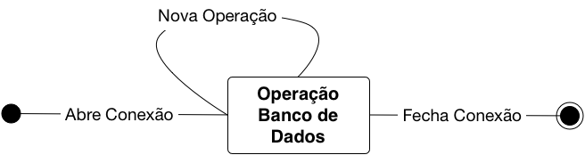

# PHP e Banco de Dados

A comunicação de uma aplicação com o banco de dados geralmente é baseada na ideia de conexão. Toda vez que é necessário fazer uma manipulação no banco de dados, abre-se uma conexão com o banco desejado, realiza as operações necessárias, e então fecha a conexão. A Figura abaixo mostra de forma visual como essa interação é feita:

Em outras palavras, o processo de manipulação dos dados de um banco de dados é composto por três etapas:

1. Abertura da conexão com o banco de dados
2. Execução das consultas no banco de dados
3. Fechamento da conexão com o banco de dados

As linguagens de programação, geralmente, possuem bibliotecas que realizam as ações necessárias para cada uma das etapas descritas acima. Essas bibliotecas se comunicam por meio do SGBD no qual o banco de dados está inserido. Para cada SGBD, as linguagens possuem uma biblioteca específica para manipulação do banco de dados naquele SGBD.

O PHP possui uma série de funções pré-definidas para lidar com os SGBDs MySQL, PostgreSQL, e SQLite. Este capítulo mostrará a manipulação dos dados feita por meio do SGBD MySQL.

## Abrindo uma conexão

Para se conectar em um SGBD, utilizamos a função `mysqli_connect`, que pode ser vista detalhadamente abaixo:

    mysqli_connect(string servidor, string usuario, string senha, string bd);

A função `mysqli_connect` admite quatro parâmetros principais: `servidor`, `usuario`, `senha` e `bd`. O parâmetro `servidor` representa a URL onde está localizada o SGBD. Já os parâmetros `usuario` e `senha` representam os dados do usuário que será utilizado para o PHP estabelecer conexão com o SGBD. Por fim, o parâmetro `bd` representa qual banco de dados será selecionado na conexão. O trecho de código abaixo mostra um exemplo de conexão com o banco de dados:

    $conexao = mysqli_connect("localhost", "root", "", "TodoList");

Neste caso, estamos nos conectando em um SGBD local, utilizando o usuário `root`, no banco de dados TodoList.

É importante observar também que o método `mysqli_connect` retorna um objeto, que por sua vez é armazenado na variável `$conexao`. Esse objeto representa a conexão que foi feita com o SGBD em si. Posteriormente a utilizaremos para fechar a conexão com o SGBD.

## Fechando uma conexão

Fechar uma conexão é extremamente simples, basta utilizar a função `mysqli_close()`:

    mysqli_close(recurso conexao);

A função `mysqli_close` admite apenas o parâmetro `conexao`. Este parâmetro representa a conexão recuperada após execução da função `mysqli_connect`, que deverá ser fechada. O trecho de código abaixo mostra como fechar a conexão aberta na seção anterior:

    mysqli_close($conexao);

É importante ressaltar que o fechamento da conexão deve ser feito somente após a execução de todo código relacionado a manipulação do banco de dados. Para isso recomenda-se que insira a chamada da função `mysqli_close` no fim da página PHP.

## Executando consultas SQL

Após abertura da conexão com o SGBD, o PHP nos permite utilizar consultas SQL para fazer as devidas manipulações no banco de dados selecionado. Toda consulta SQL deve ser feita por meio da chamada da função `mysqli_query`, descrita abaixo:

    mysqli_query(recurso conexao, string consulta);

A função `mysqli_query` admite dois parâmetros: `consulta` e `conexao`. O parâmetro `consulta` é uma string que contém a *query* SQL que será executada, e deve ser obrigatoriamente fornecida na chamada da função. Já o parâmetro `conexao` representa o recurso aberto com o banco de dados no qual a consulta será executada.

O trecho de código abaixo mostra um exemplo de realização de uma consulta via `mysqli_query`:

    $conexao = mysqli_connect("localhost", "root", "", "TodoList");

    $resultado = mysqli_query($conexao, "SELECT * FROM tarefas");

    mysqli_close($conexao);

### Exibindo resultados das consultas SQL

Similar ao que acontece na função `mysqli_connect`, a função `mysqli_query` também retorna um objeto resultante de sua execução. Este objeto basicamente contém o resultado proveniente da execução da consulta no banco de dados. No caso do exemplo da seção anterior, o resultado da consulta `SELECT * FROM tarefas` foi armazenado na variável `$resultado`.

É importante ressaltar que, independentemente de qual consulta SQL foi executada, o resultado desta consulta é armazenada no mesmo objeto. O PHP fornece uma série de funções para extrair as informações desse objeto. A tabela abaixo contém as principais funções:

| Comando               | Descrição                                                   |
|-----------------------|-------------------------------------------------------------|
| `mysqli_affected_rows` | Retorna o número de linhas afetadas por uma consulta        |
| `mysqli_fetch_array`   | Armazena a linha atual do resultado em um vetor associativo |
| `mysqli_fetch_object`  | Retorna uma linha como objeto                               |
| `mysqli_fetch_row`     | Armazena a linha do resultado em um vetor                   |
| `mysqli_result`        | Retorna uma coluna do resultado                             |
| `mysqli_num_rows`      | Retorna o total de linhas de uma consulta SELECT            |
| `mysqli_num_fields`    | Retorna o número total de colunas de uma consulta           |
| `mysqli_field_name`    | Retorna o nome de uma coluna em uma consulta                |

Para as consultas que alteram os dados armazenados (INSERT, UPDATE e DELETE), geralmente a função `mysqli_affected_rows` é capaz de fornecer toda a informação necessária (nesse caso, o número de linhas afetadas pela execução da consulta). O trecho de código abaixo mostra como utilizar essa função:

    //... abertura da conexão

    $resultado = mysqli_query($conexao, "DELETE FROM tarefas WHERE data_limite < NOW()");
    $num_linhas = mysqli_affected_rows($resultado);
    echo "Foram excluídas $num_linhas tarefas";

    //... fechamento da conexão

Já para a consulta que listam os dados existentes (SELECT), é necessário um processamento mais elaborado a fim de recuperar as informações necessárias. Para recuperar o total de registros (linhas) resultantes do SELECT, utilizamos a função `mysqli_num_rows`. O mesmo pode ser aplicado para o total de colunas, que pode ser obtido por meio da função `mysqli_num_fields`.

Já para recuperar as informações de cada registro, é necessário utilizar uma das funções `mysqli_fetch_*`. A função `mysqli_fetch_row` retorna os dados de cada registro por meio de um vetor, onde os dados de cada campo (coluna) do registro pode ser acessado por um índice numérico. Já a função `mysqli_fetch_array` retorna os dados do registro por meio de um vetor associativo, onde se utiliza o nome de cada coluna para acessar seus respectivos valores no registro. Por fim, a função `mysqli_fetch_object` converte os dados do registro para um objeto, onde os valores das colunas são convertidos para propriedades do objeto.

O trecho de código abaixo mostra um exemplo de como recuperar, converter, e utilizar as informações resultantes de uma consulta SELECT:

    //... abertura da conexão

    $resultado  = mysqli_query("SELECT nome, data_nascimento FROM usuarios");
    $num_linhas = mysqli_num_rows($resultado);

    echo "Encontrados $i registros.\n\n";

    for($i = 0; $i < $num_linhas; $i++) {
      $usuario = mysqli_fetch_array($resultado);
      echo "usuário $i: " . $usuario["nome"] . " " . $usuario["data_nascimento"] . "\n";
    }

    //.. fechamento da conexão
